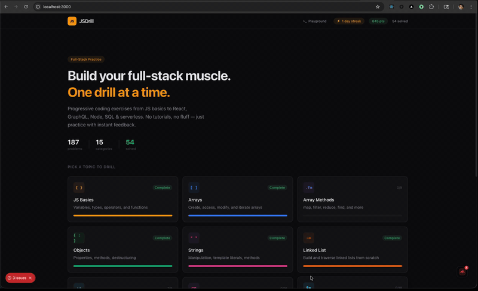

<section class="ep-showcase">

  

    Dashboard
    <h2>Real-time error monitoring</h2>
    
Health scores, error timelines, filterable error lists, plain-English explanations, full stack traces, HTTP request logs, and console output — all updating live via WebSocket.

    <a href="/ErrPulse/guide/getting-started" class="ep-showcase-link">Get started →</a>
  

  

    
  

  

    DevTools Widget
    <h2>Debug without leaving your app</h2>
    
A floating in-app panel with Errors, Console, and Network tabs. Click to expand stack traces, inspect JSON payloads, and view API responses — all inside a Shadow DOM that won't touch your styles.

    <a href="/ErrPulse/guide/devtools" class="ep-showcase-link">Learn more →</a>
  

  

    
  

</section>

